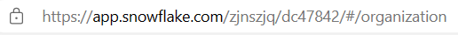
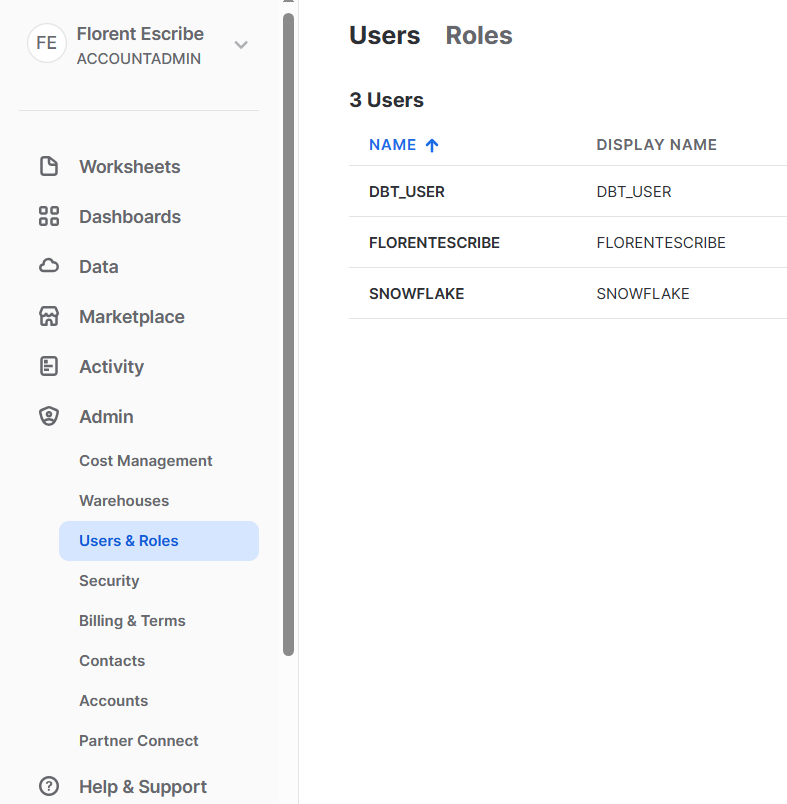
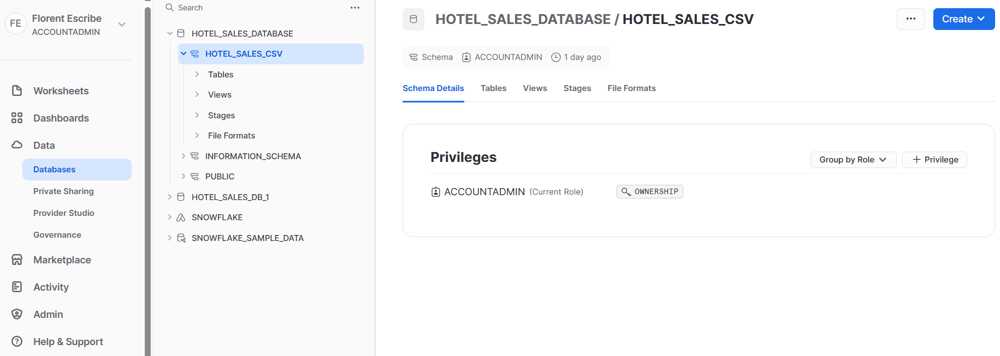
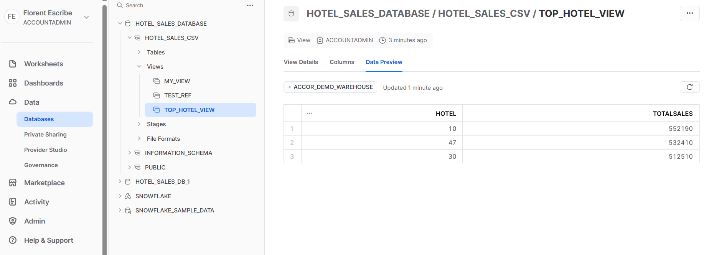

# Doc setup dbt

# Prerequisites :

- A Snowflake environment with a data csv and an SQL query to extract some intelligence from it.
    - SQL query
    
    ```sql
    SELECT Hotel, SUM(Sales) AS TotalSales
    FROM hotel_sales_database.hotel_sales_csv.hotel_sales_table
    GROUP BY Hotel
    ORDER BY TotalSales DESC
    LIMIT 3;
    ```
    
- dbt up and running (CLI installed)

# MODOP

- In the terminal, enter `dbt init accor_demo_dbt`
    - **Database** : The number for Snowflake
    - **Account** : Your account id
        - You can find it in the url, here it would be `zjnszjq-dc47842`
        
        
        
    - **user** : The existing user list can be found in Snowflake Admin menu, in section *Users & Roles*
    
    

    
    - **Authentication method** : Password
    - Choose a **password**
    - **role** : The list of roles can be found in the same section as Users, in the *Role* tab.
    - **warehouse** : The warehouse list can be found in Snowflake Admin menu, in section *Warehouses.*
    - **database** : The list is in Snowflake/Data/Databases menu.
    - **schema** : Clicking on the database you need will reveal the schemas it contains.
    
    

    
    - threads : 1
    - Done ! ✅ A folder `accor_demo_dbt` has been created.
- Navigate that folder.
- You can check that the `profile` name in dbt_project.yml exists in `~/.dbt/profiles.yml` and that it is rightly configured.
- In `models` folder
    - Delete `example` folder.
    - Create a `top_hotel_view.sql` file.
    - From Snowflake, copy and paste the SQL query for the three top selling hotels
    - In the `FROM` part, replace the table name by `{{ source('hotel_sales', 'HOTEL_SALES_TABLE') }}`.
    - Remove the `;` at the end.
    - DBT query
        
        ```sql
        SELECT Hotel, SUM(Sales) AS TotalSales
        FROM {{ source('hotel_sales', 'HOTEL_SALES_TABLE') }}
        GROUP BY Hotel
        ORDER BY TotalSales DESC
        LIMIT 3
        ```
        
    - Create a `hotel_sales.yml` file.
    - Enter the following code for dbt to know where to get the data from.
    
    ```yaml
    sources:
      - name: hotel_sales
        database: HOTEL_SALES_DATABASE
        schema: HOTEL_SALES_CSV  
        tables:
          - name: HOTEL_SALES_TABLE
    ```
    
- In the terminal, enter `dbt run`
- In Snowflake, a new view TOP_HOTEL_VIEW has appeared.



- Click `Data Preview` to visualize the output of the query.

- In the terminal, enter `dbt docs generate` then `dbt docs serve`, a web page will open, showing documentation on the Snowflake project.

# Formatter/Linter

- Install [VSCode extension SQLFluff](vscode:extension/dorzey.vscode-sqlfluff)

- Open [.vscode/settings.json](.vscode/settings.json)

- Unquote the line `"sqlfluff.dialect": "ansi"` and save changes.

- SQL files are now formatted on save !